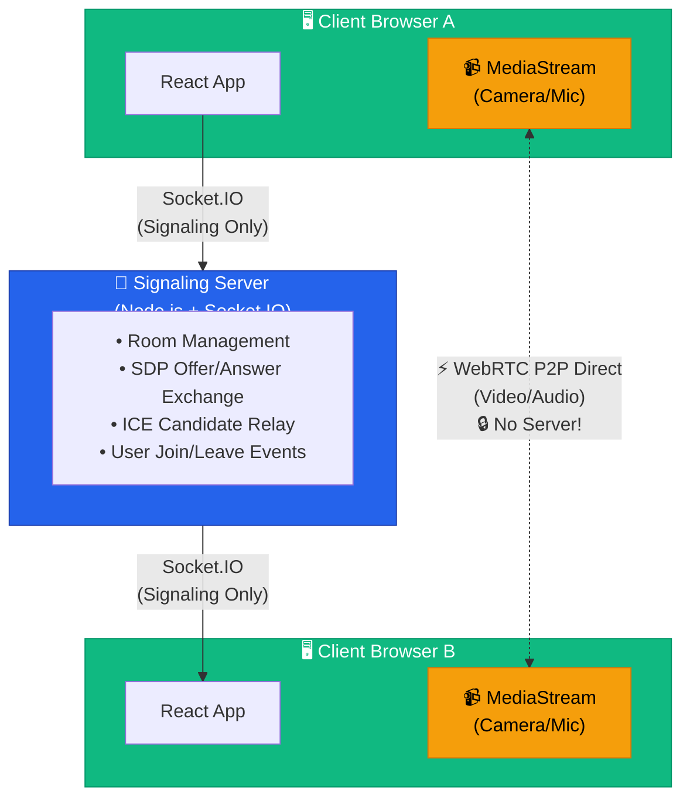

# 🌐 Universal Link

**Real-time Video Communication Platform with AI-Powered Sign Language Translation**

Universal Link is a peer-to-peer video calling application designed to bridge communication gaps between sign language users and speakers. Built with WebRTC for low-latency video streaming and featuring AI-powered sign language recognition, this platform enables seamless real-time translation and inclusive communication.

---

## ✨ Key Features

### 🎥 **WebRTC Video Calling**
- **Peer-to-peer connectivity** with sub-200ms latency
- **Multi-participant support** via room-based architecture
- **STUN server integration** for NAT traversal using Google's public STUN servers

### 👋 **Sign Language Detection**
- **Real-time hand tracking** powered by MediaPipe/TensorFlow
- **AI-powered gesture recognition** for American Sign Language (ASL)
- **Sentence building** with gesture-to-text conversion
- **Live translation overlay** for seamless communication

### 💬 **Built-in Chat System**
- **Text messaging** alongside video communication
- **Sign-to-text messages** with special indicators
- **Real-time message synchronization** across all participants

### 🔒 **Privacy & Security**
- **Direct P2P connections** - video never routed through servers
- **End-to-end encryption** via WebRTC's built-in DTLS-SRTP
- **No data storage** - ephemeral room-based sessions

### 🎨 **Modern UI/UX**
- **Responsive design** with TailwindCSS v4
- **Dark mode support** with theme customization
- **Accessible interface** following WCAG guidelines
- **Real-time participant indicators** and connection status

---

## 🛠️ Technology Stack

### **Frontend**
- **Framework:** React 19 with TypeScript
- **Build Tool:** Vite 7
- **Styling:** TailwindCSS v4 with Radix UI components
- **State Management:** React Hooks (useState, useEffect, useRef, useCallback)
- **Routing:** React Router DOM v7
- **Real-time Communication:** Socket.IO Client v4.8
- **Icons:** Lucide React

### **Backend**
- **Runtime:** Node.js with Express v5
- **WebSocket Server:** Socket.IO v4.8
- **CORS Handling:** CORS middleware
- **Environment Config:** dotenv

### **WebRTC & Media**
- **Video Protocol:** WebRTC (RTCPeerConnection)
- **ICE Servers:** Google STUN servers (stun.l.google.com)
- **Media API:** getUserMedia for camera/microphone access

### **AI/ML (Planned)**
- **Hand Tracking:** MediaPipe Hands
- **Sign Recognition:** TensorFlow.js with custom ASL model

---

## 🏗️ Architecture Overview

### **Key Principle: Signaling vs Media Separation**

> 🔑 **The signaling server is ONLY used for initial connection setup.** Once the WebRTC peer connection is established, all video/audio streams flow **directly P2P between clients** - the server never handles media data.



### **Connection Flow:**

**Phase 1: Signaling (via Server)**
1. ✅ Clients connect to signaling server via Socket.IO
2. ✅ Users join rooms with unique Room IDs
3. ✅ Signaling server coordinates WebRTC handshake:
   - Exchange SDP offers/answers (session descriptions)
   - Relay ICE candidates (network path discovery)
   - Notify peers about joins/leaves

**Phase 2: Direct P2P (No Server)**
4. ✅ Once WebRTC connection is established, clients communicate **directly**
5. ✅ All video/audio streams flow **peer-to-peer** without server involvement
6. ✅ Signaling server remains connected only for control messages (new peers joining, etc.)

**Result:** Ultra-low latency (<200ms) with complete privacy - your video never touches the server!

---

## 📋 Prerequisites

Before you begin, ensure you have the following installed:

- **Node.js** (v18.x or higher)
- **npm** (v9.x or higher) or **pnpm**
- **Modern browser** with WebRTC support (Chrome, Firefox, Edge, Safari 11+)
- **HTTPS/localhost** (WebRTC requires secure context for camera/mic access)

---

## 🚀 Installation & Setup

### **1. Clone the Repository**
```bash
git clone https://github.com/RunTime-Terrors-NITC/Universal-Link
cd Universal-Link
```

### **2. Backend Setup**

Navigate to the backend directory and install dependencies:

```bash
cd backend
npm install
```

Create a `.env` file based on `.env.example`:

```bash
cp .env.example .env
```

Edit `.env` with your configuration:

```env
PORT=4000
FRONTEND_URL=http://localhost:3000,http://127.0.0.1:3000
```

Start the backend server:

```bash
# Development mode with auto-reload
npm run dev

# Production mode
npm start
```

The signaling server will be running on `http://localhost:4000`

### **3. Frontend Setup**

Navigate to the frontend directory and install dependencies:

```bash
cd ../frontend
npm install
```

Create a `.env` file based on `.env.example`:

```bash
cp .env.example .env
```

Edit `.env` with your configuration:

```env
VITE_PORT=3000
VITE_BACKEND_URL=http://localhost:4000
```

Start the development server:

```bash
npm run dev
```

The application will be available at `http://localhost:3000`

### **4. Build for Production**

**Frontend:**
```bash
cd frontend
npm run build
```
Production build will be in `frontend/dist/`

**Backend:**
```bash
cd backend
npm start
```

---

## 🎯 Usage

### **Creating a Room**
1. Open the application at `http://localhost:3000`
2. Enter your **Display Name**
3. Click **"Create Room"** to generate a new session
4. Share the generated **Room ID** with participants

### **Joining a Room**
1. Open the application
2. Enter your **Display Name**
3. Enter the **Room ID** provided by the host
4. Click **"Join Room"**

### **During a Call**

**Controls:**
- 🎤 **Toggle Microphone** - Mute/unmute audio
- 📹 **Toggle Camera** - Turn video on/off
- 📞 **End Call** - Leave the room and return to home
- 💬 **Chat** - Open text chat panel
- ⚙️ **Options** - Access sign mode and sound settings

**For Sign Language Users:**
- Enable **"Sign Mode"** from the options menu
- Use hand gestures in front of the camera
- Detected signs will appear in the overlay
- Sentences build automatically and can be sent to other participants

---

## 🔌 WebSocket Events

The signaling server uses Socket.IO with the following events:

### **Client → Server**

| Event | Payload | Description |
|-------|---------|-------------|
| `join-room` | `roomId: string` | Join a specific room |
| `leave-room` | `roomId: string` | Leave the current room |
| `offer` | `{ offer: RTCSessionDescription, to: string }` | Send WebRTC offer to peer |
| `answer` | `{ answer: RTCSessionDescription, to: string }` | Send WebRTC answer to peer |
| `ice-candidate` | `{ candidate: RTCIceCandidate, to: string }` | Send ICE candidate to peer |

### **Server → Client**

| Event | Payload | Description |
|-------|---------|-------------|
| `joined-room` | `{ roomId: string, userId: string }` | Confirmation of room join |
| `user-joined` | `{ userId: string }` | Notify when a new user joins |
| `user-left` | `{ userId: string }` | Notify when a user leaves |
| `offer` | `{ offer: RTCSessionDescription, from: string }` | Receive WebRTC offer from peer |
| `answer` | `{ answer: RTCSessionDescription, from: string }` | Receive WebRTC answer from peer |
| `ice-candidate` | `{ candidate: RTCIceCandidate, from: string }` | Receive ICE candidate from peer |

---

## 📁 Project Structure

```
Universal-Link/
├── backend/
│   ├── .env.example          # Environment template
│   ├── package.json          # Backend dependencies
│   └── server.js             # Express + Socket.IO server
│
├── frontend/
│   ├── public/               # Static assets
│   ├── src/
│   │   ├── components/
│   │   │   ├── ui/           # Reusable UI components (shadcn/ui)
│   │   │   ├── ChatPanel.tsx # Chat interface component
│   │   │   └── VideoGrid.tsx # Video participant grid
│   │   ├── hooks/
│   │   │   └── useWebRTC.ts  # WebRTC connection logic
│   │   ├── pages/
│   │   │   ├── Home.tsx      # Landing page with room creation
│   │   │   ├── Room.tsx      # Video call interface
│   │   │   └── NotFound.tsx  # 404 page
│   │   ├── router/
│   │   │   └── index.tsx     # React Router configuration
│   │   ├── lib/
│   │   │   └── utils.ts      # Utility functions
│   │   ├── App.tsx           # Root component
│   │   ├── main.tsx          # React entry point
│   │   └── index.css         # Global styles
│   ├── .env.example          # Environment template
│   ├── package.json          # Frontend dependencies
│   ├── vite.config.ts        # Vite configuration
│   └── tsconfig.json         # TypeScript configuration
│
└── README.md                 # This file
```


---

## 🙏 Acknowledgments

- **WebRTC** for enabling real-time peer-to-peer communication
- **Socket.IO** for reliable signaling
- **MediaPipe** for hand tracking technology
- **Radix UI** and **shadcn/ui** for accessible component primitives
- **TailwindCSS** for utility-first styling
- **The open-source community** for inspiration and tools

---

**Made with ❤️ for accessible communication**